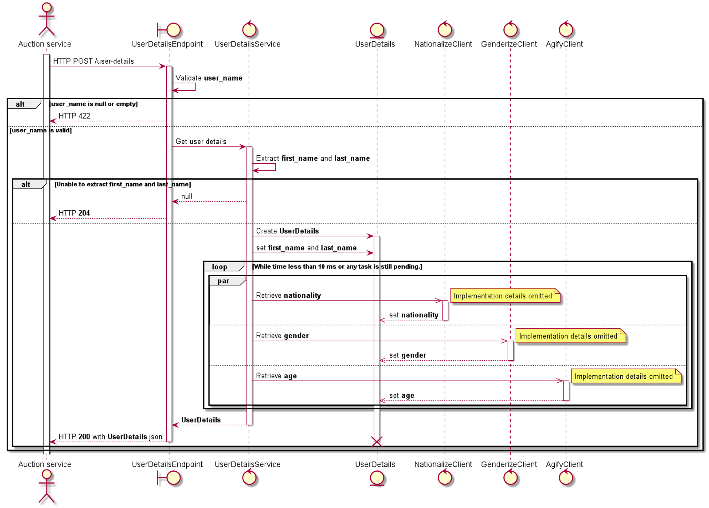
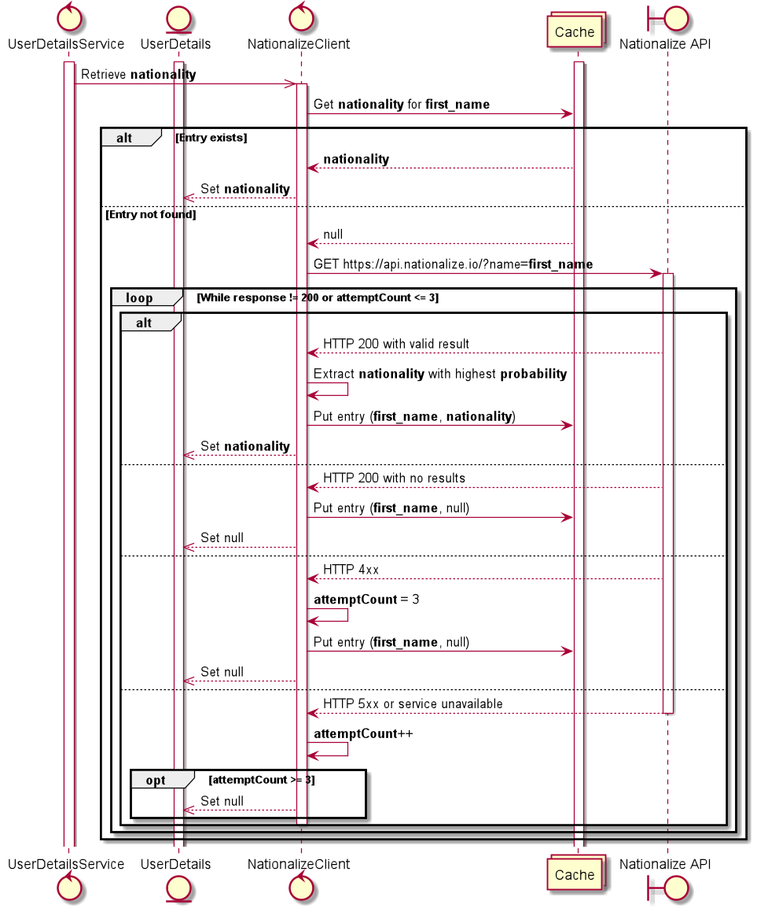
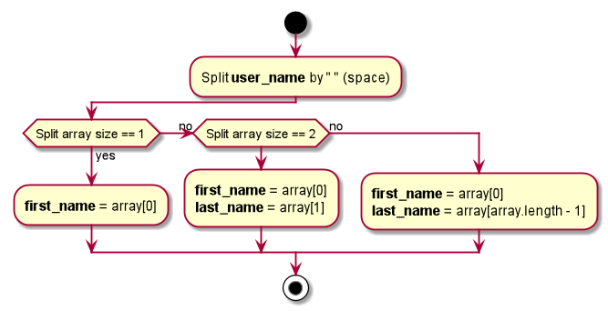

## Introduction
Currently, data processed by auction service are not as extensive as they could be. With help of additional external
APIs there is a chance to extend them with more valuable information. This could make whole auction process
more accurate and simply better. 

At the moment only user's first and last name are passed and only as a single field. 

### Goals
Main reason standing behind the project is to extend user details with following data:
* first name as a separate field
* last name as a separate field
* nationality
* gender
* age 

## How to run the project
In root folder download required dependencies using following command:
```
pip install -r requirements.txt
```

Next got to `/src` folder and start the server:
```
flask run
```

## Implementation
New API has to be created. It will reside in a standalone, dedicated http server, where whole solution will be 
written in python language.

Once created, auction service will utilize it in order to enhance user details during the auction process.

### API design
Because there is not many requirements, everything can be done in scope of a single HTTP endpoint.

#### POST /user-details
Used to collect enriched user details based on its name.

##### Request headers
|Name|Value|
|----|-----|
|Accept|application/json|
|Content-Type|application/json|

##### Request body
```json
{
  "user_name": string // not null
}
```
##### 200 Response
Sent when everything goes well and service is able to enrich user details. Following body will be attached to the 
response:
```json
{
 "first_name": string, // not null
 "last_name": string, // not null
 "nationality": string, // nullable
 "age": number, // nullable
 "gender": "male"/"female" //nullable
}
```
#### 204 Response
Sent when service is not be able to collect information about all **not null** fields.

#### 422 Response
Sent when user name provided by the client is empty or null.

### Implementation details
Client will initiate process by calling **/user-details** endpoint. Following sequence diagram shows request processing flow:


Everything starts with a simple validation of the request body. If all goes right, then further processing will
be done by ```UserDetailsService```. It will be responsible for creating ```UserDetails``` object which will be mapped 
afterwards to a json and attached to the response as its body.

Algorithm of extracting user first name and second name will be discussed in separate paragraph.

Each request sent to the external APIs will executed in asynchronous manner. Because there is strict time limit
set on the whole process, main execution thread will wait up to 10 milliseconds for pending requests to finish. 
If any of them won't be able to meet this time constraint, then http response from that API won't be applied to the final ```UserDetails``` object.
**But still these results will be stored in cache for further upcoming requests.**

Implementation of the internal clients used in communication with the external APIs has been moved to separate
diagram. Example shown below relates to ```NationalizeClient```, but the similar approach applies to communication with
the other two APIs.



As shown on the diagram, cache can be also populated with null values. It is a valid case, where it means that application 
should not take any more attempts to retrieve details from external API.
This approach applies either when there were no results in response body or API respond with 4xx http error code,
which usually means that there is something wrong with the client's request, and it should not be sent again without changing
it.

### Name extraction
Application expects to receive **user_name** value in following format: *"first_name last_name"*.
If that won't happen, application will still try to resolve these values in accordance with diagram below:



Worth to mention here is that this logic will run after validation process, so **user_name** is neither 
null nor empty.

## Further improvements

### Cache shared among nodes
Implementation shown above uses only internal cache. As a next step, it could share it among multiple nodes. Thanks
to that it will fill up quicker for most common keys, and it won't consume each process's memory separately.

### Https protocol support
In order to support secured connection, test integration server will have to authenticate itself to the client
(auction service in this case) with a certificate signed by CA accepted by it. Assuming, that the only client
will be auction service, this can be achieved by adding that certificate to the trust store used during establishing 
secured connection.

Drawback of this approach is that it will impact response time, due to messages encryption and ssl handshake.

This feature is only required when communication between the client, and the service happens outside the internal 
network.

### Authentication & Authorization
If the only client would be auction service and assuming https will be enabled, then the best option would be 
to use *ssl mutual authentication* in order to identify the client. It of course impacts also performance, because
application will first need to get client's certificate, and then check whether it accepts it.
